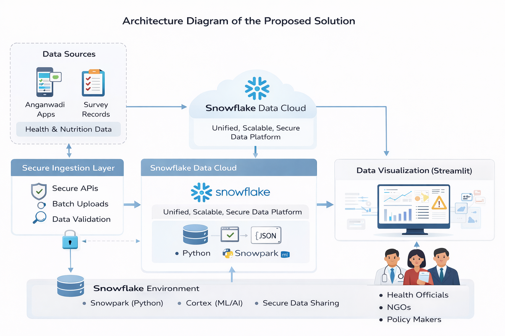
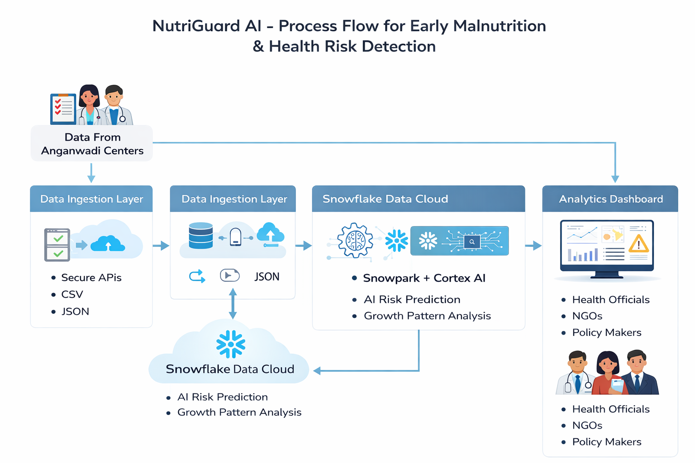

# NutriGuard AI 🧠❄️

NutriGuard AI is an AI-powered health intelligence platform built on Snowflake to enable early detection of malnutrition and health risks among children and pregnant women in rural communities.

## 🚀 Problem Statement
Malnutrition is often detected too late due to fragmented data, manual monitoring, and lack of predictive insights. This leads to preventable health complications.

## 💡 Solution
NutriGuard AI uses Snowflake Data Cloud, Snowpark, and Cortex AI to analyze health and nutrition data and generate early risk predictions, enabling timely intervention.

## 🏗️ Architecture

## 🔄 Process Flow

## 👥 Use Case Diagram

## 🛠️ Tech Stack
- Snowflake Data Cloud
- Snowpark (Python)
- Snowflake Cortex
- Streamlit
- Python

## 📊 Prototype Features
- AI-based malnutrition risk scoring
- Region-wise health heatmaps
- High-risk case alerts
- Analytics dashboard for NGOs and authorities

## ⚠️ Disclaimer
This project is a **prototype** built for the AI for Good Hackathon. Data used is simulated for demonstration purposes.

## 📹 Demo Video
(Coming soon)

## 👤 Author
Jay Vekariya
